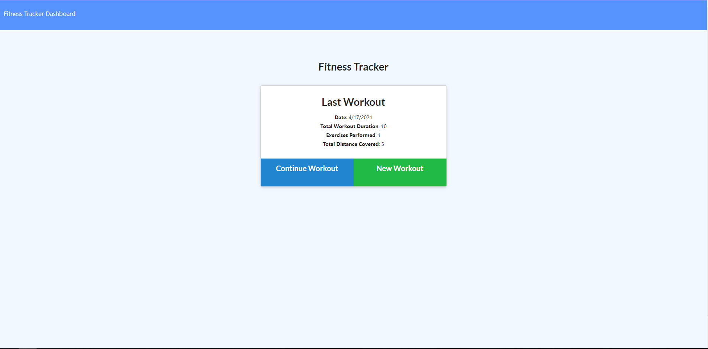

# workoutTracker

# Screenshot

# Description
The application allows the user to create a new workout or continue with their workout. There are two workout options resistance or cardio training. The user is able to view the combined weight of multiple exercises from the stats page. Also the user is able to view the total duration of each workout on the stats page.

# Deployment
https://work-traack.herokuapp.com/

https://github.com/swoo328/workoutTracker

# TECH
- MongoDB
- Express
- Node
